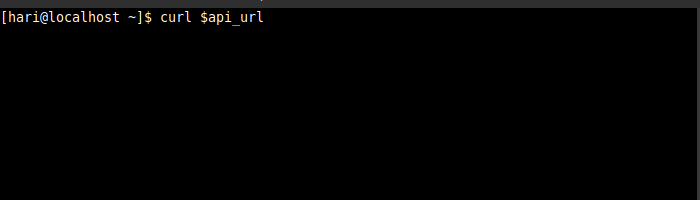
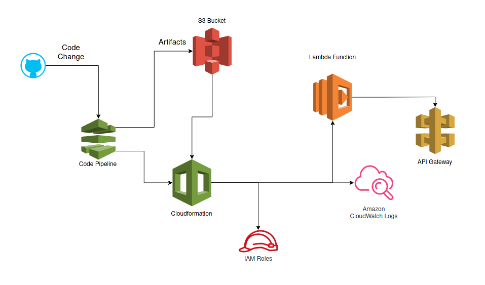

<h1 align="center">List Instances API for lambda</h1>

Lists the instances across an aws account in JSON

  

## Requiremnts

- BOTO3 (AWS SDK)
- AWS CLI
- AWS Credentials
- IAM Access
## Architecture

- Code is hosted in gitbuh and liked to Codepipeline
- Codepipelines deploys lambda and api gateway using cloudformation after testing it.
- cloudfromation logs to cloudwatch and creates required roles using IAM
- The artifacts generated during the build process is stored in S3 bucket.

## How to deploy

- Create a pipeline on AWS
- The pipeline has three required stages
  -  Source: Checks for chages in source repository and triggers the pipeline
  -  Build: Tests, converts the SAM template into a CF template to deploy lambda function, api gateway and all the nessary roles and uploads to S3.
  -  Deploy: Uses the cloudformation template from the build stage stored in S3 to deploy and then update the lambda function and api gateway.
- Source need to be linked to the github using webhooks or in case of code commit it can be directly hooked up with it
- Build stage is configured in the Buildspec.yml
  - This stage needs ec2 read only access and s3 write access attached to a role.
  - Build stage spawns a container and installs pytest to test the lambda function
  - test_app.py is written to test the validity of the response, the time taken for the response and the memory used by the program to run and verifies if its in line with the lambda we declared. the pipeline will abort if all three tests dont pass. This step needs the ec2 read only permission to run the function.
  - once the tests pass, [the SAM template](https://aws.amazon.com/serverless/sam/) (Click for More info) template.yaml is converted into a cloud formation template and is stored in an S3 bucket artificats-instance-list-api-xfas34f created before hand.
- Deploy stage deploys the code with the cloudformation template now stored in the S3 bucket artificats-instance-list-api-xfas34f.
  - This requires permission to deploy each service defined in cloudformation and configure them.
